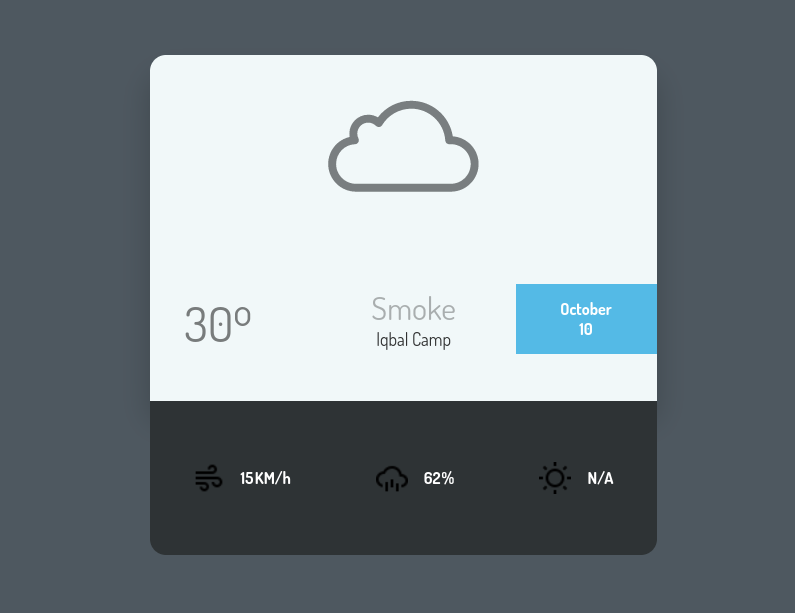

# weather-app

  

Simple and elegant weather app written in HTML/CSS and powered with JS

Requires location permission to auto fetch the location and show the weather data. 

**Weather Data Provider:** [openweather](https://openweathermap.org/api)

**Attention:** I have included the API key registered against my openweather account for the live preview purpose only. Please do not abuse it by making excessive calls or use it in your own project(s). 

### [Live preview](https://taseerahmad.github.io/weather-app/) 
